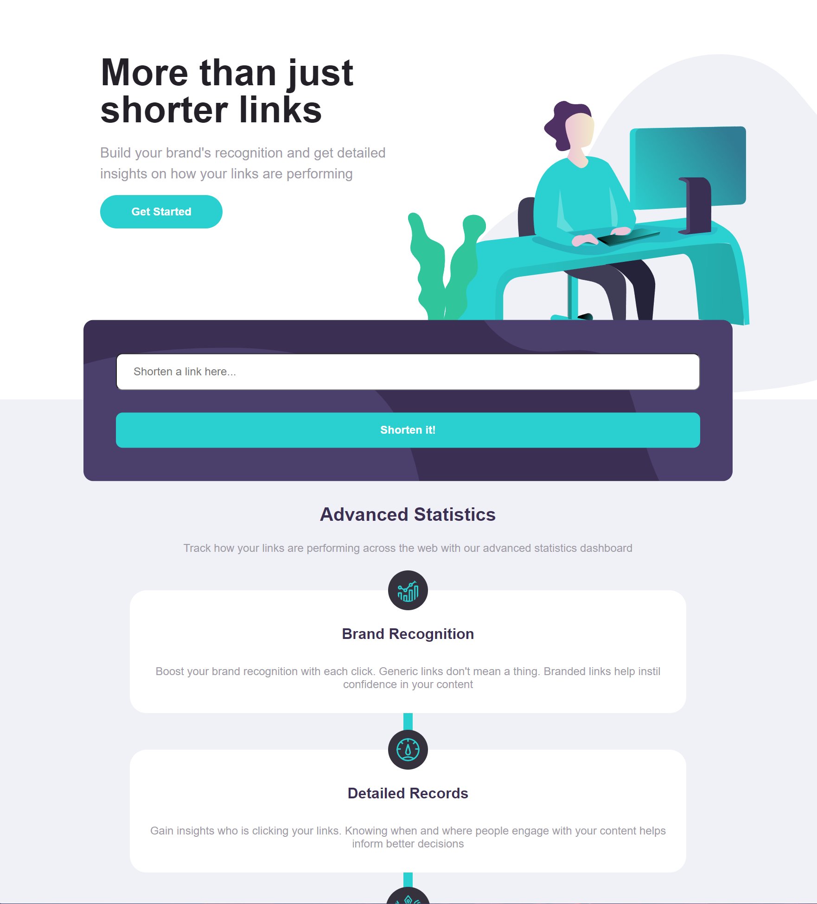

## Shortly is a URL shortening website
Recreated website using TypeScript, CSS, and HTML following a JPG and Figma design file making the website responsive and mobile first. 

https://shortly-jp.netlify.app/

<center>


</center>
<br>

## Getting Started

### Clone this repository

```bash
git clone git@github.com:joeepark/Shortly-Website.git
```

### Install dependencies

```bash
npm install
```

### Run in development

```bash
npm run dev
```
